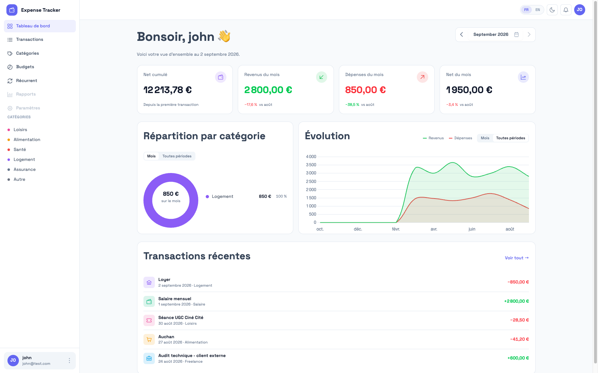
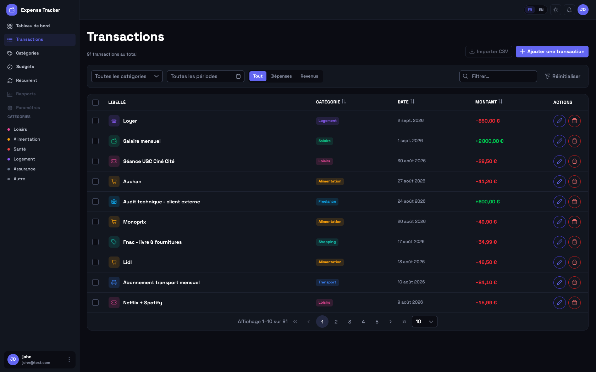
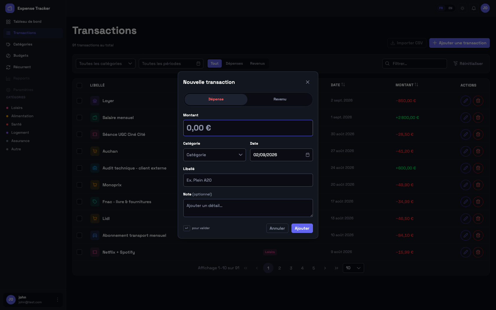
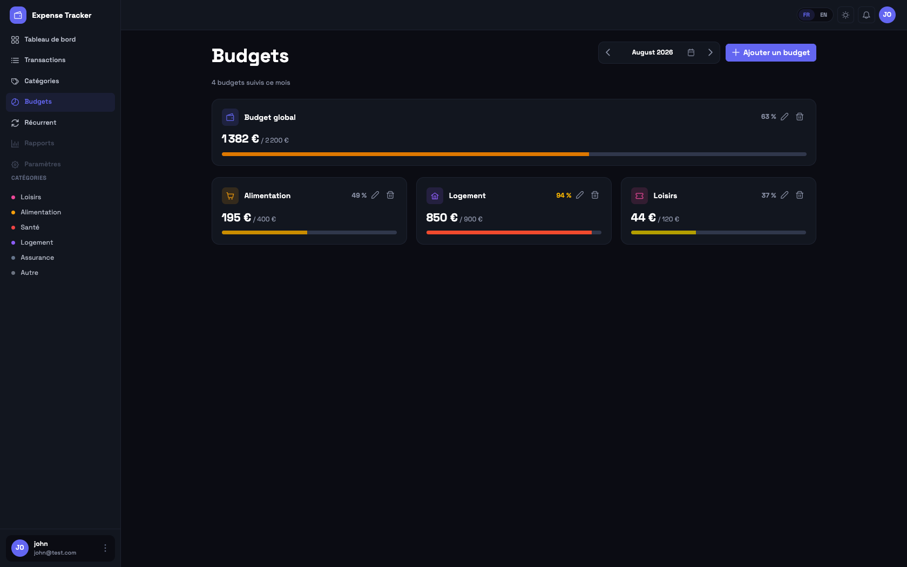
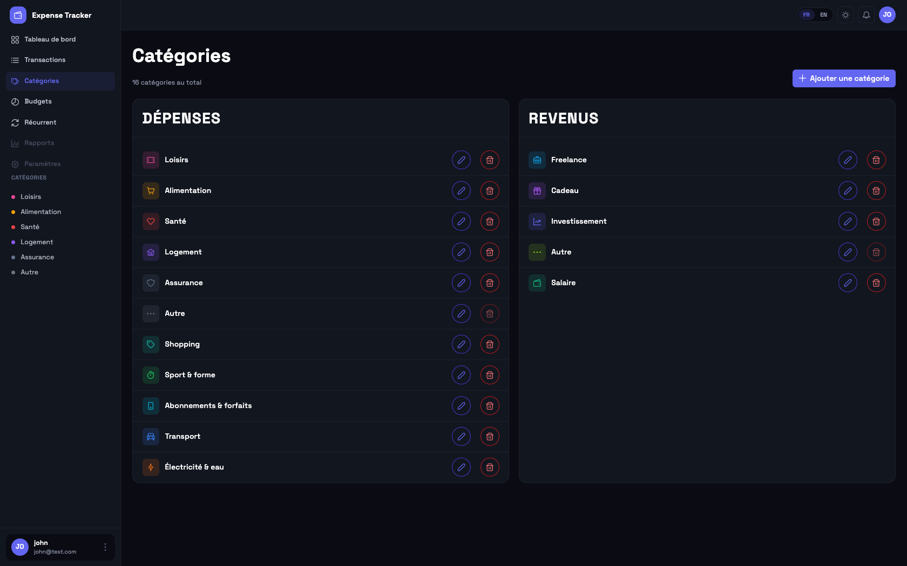

# 💶 Expense Tracker

> Un suivi de budget clair : chaque flux bancaire classé, chaque catégorie plafonnée, chaque mois comparable au précédent.


-6366F1?logo=primeng&logoColor=white>)


Application web de suivi budgétaire personnel : transactions classées par catégorie,
budgets mensuels (par catégorie ou global) avec reconduction automatique, charges
récurrentes générées en tâche de fond, dashboard avec graphiques, et interface
bilingue français/anglais avec bascule instantanée.



---

## 🔗 Démo live

**[calm-glacier-08876b503.5.azurestaticapps.net](https://calm-glacier-08876b503.5.azurestaticapps.net)**

Pas d'inscription publique pour l'instant — deux comptes de démo :

| Utilisateur | Mot de passe | Contenu                                                                                 |
| ----------- | ------------ | --------------------------------------------------------------------------------------- |
| `john`      | `Pa$$w0rd`   | Jeu de données réaliste (transactions, budgets, charges récurrentes sur plusieurs mois) |
| `admin`     | `Pa$$w0rd`   | Compte vide, rôle Admin                                                                 |

> L'API et le front tournent sur des paliers gratuits Azure (App Service F1) et une base
> Neon gratuite : le premier appel après une période d'inactivité peut prendre quelques
> secondes le temps que l'instance se réveille.

---

## ✨ Fonctionnalités

- **Transactions** — CRUD complet, filtres (compte/catégorie/type/période), tri,
  pagination serveur, sélection multiple, saisie rapide en dialog modal
- **Catégories personnelles** — chaque utilisateur reçoit sa propre copie d'un jeu de
  catégories de départ à l'inscription ; création/renommage/suppression libres, avec
  réassignation automatique des transactions vers une catégorie « Other » verrouillée
- **Budgets** — plafond mensuel par catégorie ou budget global (toutes catégories de
  dépense), barre de progression, reconduction automatique d'un mois sur l'autre
  (`AutoRenew`) via une tâche planifiée
- **Charges récurrentes** — dépenses ou revenus périodiques (hebdo/mensuel/annuel),
  génération automatique de la transaction à échéance, rattrapage des occurrences
  manquées après un arrêt du service
- **Dashboard** — net cumulé, répartition des dépenses par catégorie (donut), courbe
  dépenses/revenus sur 12 mois, transactions récentes
- **Bilingue FR/EN** — bascule instantanée sans rechargement (ngx-translate côté
  Angular, `IStringLocalizer` côté API pour les messages d'erreur), montants et dates
  formatés selon la locale active
- **Authentification** — ASP.NET Core Identity + JWT (access token court + refresh
  token en cookie httpOnly), isolation stricte des données par utilisateur

Hors périmètre pour l'instant : multi-devise, comptes bancaires multiples avec solde
réel, import CSV de relevé, notifications in-app, inscription publique. Détail complet
du scope dans [`context/project-overview.md`](context/project-overview.md).

---

## 🖼️ Captures d'écran

|                     Transactions                     |                    Saisie rapide                     |
| :---------------------------------------------------: | :---------------------------------------------------: |
|  |  |

|                Budgets                 |                  Catégories                  |
| :-------------------------------------: | :-------------------------------------------: |
|  |  |

---

## 🤔 Pourquoi ce projet

Le domaine (suivi de budget) est volontairement simple — la profondeur technique est
concentrée sur des chantiers concrets et démontrables plutôt que sur la complexité
métier :

| Chantier                                                            | Ce que ça démontre                                                                                   |
| ------------------------------------------------------------------- | ---------------------------------------------------------------------------------------------------- |
| Auth JWT + isolation multi-tenant                                   | Sécurité applicative, autorisation au niveau des données, refresh token                              |
| Architecture en couches (Controller → Service/Repository → EF Core) | Séparation des responsabilités, DTOs, injection de dépendances                                       |
| Jobs planifiés idempotents (`BackgroundService`)                    | Reconduction de budgets et génération de charges récurrentes, sans doublon même après un redémarrage |
| Bilinguisme FR/EN de bout en bout                                   | i18n complète — front et back — souvent absente des projets portfolio                                |
| CI/CD GitHub Actions → Azure                                        | Pipeline build + test + déploiement automatique sur push                                             |

---

## 🏗️ Stack technique

| Couche      | Techno                                                                                          |
| ----------- | ----------------------------------------------------------------------------------------------- |
| Frontend    | Angular 21 (standalone, signaux), PrimeNG 21 (thème Sakai), Tailwind 4, Chart.js, ngx-translate |
| Backend     | ASP.NET Core 10 Web API, ASP.NET Core Identity + JWT                                            |
| Données     | PostgreSQL (Npgsql), Entity Framework Core 10, migrations versionnées                           |
| i18n        | ngx-translate (front) + `IStringLocalizer` (back)                                               |
| Hébergement | Azure Static Web Apps (front) + Azure App Service (API) + Neon (Postgres serverless)            |
| CI/CD       | GitHub Actions — build, test, déploiement automatique sur `main`                                |

### Architecture backend

Un seul projet ASP.NET Core, quatre couches à sens unique :

```
Controller ──▶ Service / Repository ──▶ DbContext (EF Core) ──▶ PostgreSQL
```

Isolation multi-tenant imposée par la signature des méthodes de repository
(`GetByIdAsync(id, userId, ct)`) plutôt que par convention — le compilateur empêche
d'oublier le filtre `UserId`. Détail complet dans
[`context/project-overview.md`](context/project-overview.md).

---

## 🚀 Démarrer en local

### Prérequis

- [.NET SDK 10](https://dotnet.microsoft.com/download)
- [Node.js 22+](https://nodejs.org)
- [Docker](https://www.docker.com/) (pour PostgreSQL)
- `dotnet-ef` : `dotnet tool install --global dotnet-ef`

### Base de données

```bash
docker compose up -d
```

### Backend (`/API`)

```bash
cd API
dotnet ef database update --project .
dotnet run --project .
# API disponible sur https://localhost:5001
```

Au démarrage, l'API applique les migrations en attente puis initialise les comptes de
démo (`john` / `admin`, voir [Démo live](#-démo-live)) et leurs données associées.

### Frontend (`/client`)

```bash
cd client
npm install
npm start
# App disponible sur https://localhost:4200
```

Le frontend attend un certificat local auto-signé (`client/ssl/*.pem`) pour servir en
HTTPS — nécessaire pour matcher les origines autorisées par le CORS de l'API.

---

## 🔄 CI/CD

Un pipeline GitHub Actions unique (`.github/workflows/ci-cd.yml`) build et teste l'API
et le client à chaque push/PR, puis déploie automatiquement sur push vers `main` :
l'API sur Azure App Service, le front sur Azure Static Web Apps.

---

## 🗺️ Roadmap

Voir [`context/current-feature.md`](context/current-feature.md) pour l'historique
détaillé de chaque fonctionnalité livrée. Prochains chantiers : import CSV de relevé
bancaire, notifications in-app, inscription publique, comptes bancaires avec solde
réel.

---

## 📄 Licence

[MIT](LICENSE)
